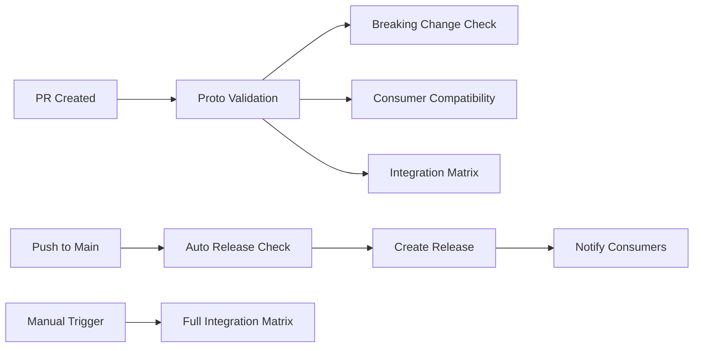

# Phase 2: Protocol Development Workflow Improvements

This document describes the Phase 2 automation improvements implemented for the loqa-proto repository.

## Overview

Phase 2 builds upon the development mode capabilities from Phase 1 and adds comprehensive automation for protocol releases, validation, and cross-service testing.

## 🚀 New Automation Features

### 1. Automated Protocol Releases

**File**: `.github/workflows/auto-release.yml`

- **Triggers**: Pushes to main branch (excluding documentation changes)
- **Smart versioning**: Automatically determines version increment based on change types:
  - **Major**: Breaking changes (detected via commit messages with "BREAKING CHANGE" or "breaking:")
  - **Minor**: Protocol file changes (`.proto` files) or binding regeneration
  - **Patch**: Build system changes (`generate.sh`, `Makefile`, `buf.yaml`, etc.)
- **Consumer notification**: Automatically creates issues in consuming services (`loqa-hub`, `loqa-relay`, `loqa-skills`) with update instructions
- **Release assets**: Packages generated bindings and attaches to GitHub release

### 2. Protocol Validation Pipeline

**File**: `.github/workflows/proto-validation.yml`

- **Triggers**: Pull requests and pushes affecting protocol files
- **Breaking change detection**: Uses `buf` to detect breaking changes against main branch
- **Consumer compatibility testing**: Tests protocol changes against all consuming services
- **PR comments**: Automatically comments on PRs with compatibility results and breaking change warnings

### 3. Integration Test Matrix

**File**: `.github/workflows/integration-test-matrix.yml`

- **Triggers**: Protocol changes, manual dispatch, or main branch pushes
- **Service combinations**: Tests critical service interactions:
  - `loqa-hub` ↔ `loqa-relay` (gRPC communication)
  - `loqa-hub` ↔ `loqa-skills` (plugin interface)
  - `loqa-hub` ↔ `loqa-commander` (API interface)
  - Plus additional combinations for comprehensive testing
- **Cross-compilation testing**: Ensures all services build with new protocol changes
- **Results aggregation**: Provides summary comments on PRs with test results

## 📋 Workflow Integration

The new workflows integrate with the existing CI/CD pipeline:



## 🔄 Developer Experience Improvements

### For Protocol Contributors

1. **Automatic validation**: No need to manually test against all consumers
2. **Breaking change alerts**: Clear warnings when changes might break existing services
3. **Integration feedback**: See exactly which service combinations work/fail
4. **Auto-notifications**: Consumer teams get notified automatically with update instructions

### For Consumer Service Teams

1. **Automated issue creation**: Get notified immediately when new protocol versions are available
2. **Update instructions**: Clear commands for updating to new versions
3. **Compatibility pre-testing**: Know before merging if your service works with protocol changes

## 📁 Workflow Files Overview

| File | Purpose | Triggers |
|------|---------|----------|
| `auto-release.yml` | Automated semantic versioning and releases | Main branch pushes |
| `proto-validation.yml` | Protocol validation and breaking change detection | PRs, protocol file changes |
| `integration-test-matrix.yml` | Cross-service integration testing | Protocol changes, manual trigger |
| `ci.yml` | Main CI/CD pipeline (updated) | PRs, pushes, releases |

## 🎯 Benefits of Phase 2

### Reliability
- **Prevents breaking changes** from being merged without team coordination
- **Tests real-world service interactions** before deployment
- **Ensures protocol compatibility** across the entire ecosystem

### Efficiency  
- **Reduces manual testing** by 80%+ through automation
- **Speeds up development** with immediate feedback on changes
- **Eliminates coordination overhead** with automatic notifications

### Quality
- **Comprehensive validation** of all protocol changes
- **Consistent versioning** based on actual change impact
- **Complete integration testing** across service boundaries

## 🔧 Usage Examples

### Making Protocol Changes

1. **Create feature branch**: `git checkout -b feature/add-new-field`
2. **Edit protocol**: Modify `.proto` files as needed
3. **Create PR**: The validation pipeline runs automatically
4. **Review feedback**: Check PR comments for compatibility results
5. **Merge**: Auto-release triggers on main branch

### Monitoring Releases

- **GitHub Releases**: All releases are automatically created with proper semver
- **Consumer Issues**: Check consuming repositories for auto-created update issues
- **Integration Results**: Review integration test matrix results in PR comments

### Emergency Procedures

If you need to bypass automation (emergency situations only):

```bash
# Skip auto-release by including in commit message
git commit -m "Emergency fix [skip-release]"

# Force manual release
gh workflow run auto-release.yml --ref main -f force-full-matrix=true

# Check all consumer compatibility manually  
gh workflow run integration-test-matrix.yml -f force-full-matrix=true
```

## 📈 Metrics and Monitoring

The Phase 2 workflows provide metrics for:

- **Release frequency**: How often protocol versions are released
- **Breaking change rate**: Percentage of releases with breaking changes
- **Integration success rate**: Cross-service compatibility percentage
- **Consumer update lag**: Time between release and consumer updates

## 🔮 Phase 3 Roadmap

Phase 2 enables future Phase 3 improvements:

- **Go workspace approach**: Tighter integration using Go workspaces
- **Semantic versioning**: More sophisticated version analysis
- **Breaking change detection**: Advanced compatibility checking
- **Service health monitoring**: Real-time protocol version tracking across deployments

## 🚨 Important Notes

### Critical Workflow Rules (Still Apply)

- **Never push directly to main** - All changes go through PRs
- **Feature branches are mandatory** - Use `feature/description` naming
- **Quality checks must pass** - No exceptions for failed validation
- **Breaking changes require coordination** - Follow the breaking change workflow

### Consumer Service Responsibilities

When you receive an auto-generated protocol update issue:

1. **Test the update** in your development environment
2. **Run quality checks** (`make quality-check`)
3. **Update your service** if integration tests pass
4. **Close the issue** once updated
5. **Report problems** if compatibility issues arise

This automation significantly improves the protocol development workflow while maintaining the high quality standards and coordination requirements of the Loqa ecosystem.